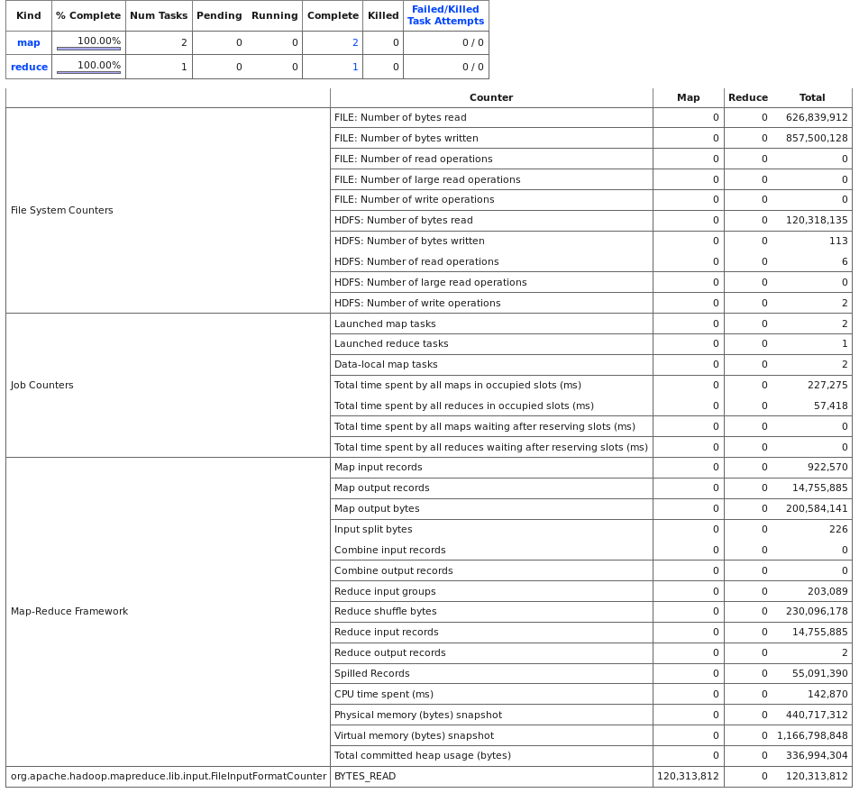

# Map_Reduce_Design_Patterns
We are performing mapreduce querying on 120MB of forum data.

Here are what we performing and its folders:

1- Filtering short sentces ``~/Filtering Patterns/filter.py``

2- Finding top10 lenghty comments ``~/Filtering Patterns/top10.py``

3- Finding number of the repition of ``fantstic`` in all the comments ``~ Summarizing Patterns/mapper_sum.py`` and ``reducer.py``
4- Finding the nodes containing  ``fantastically`` in all the comments ``~ Summarizing Patterns/mapper_sum.py`` and ``reducer.py``

Here is a snapshot of the results for point 3 and 4:

```fantstic word occured 345 times	
fantastically occured in ['7004477', '1007765', '1025821', '17583', '9006895']
```


You can also see the map-reduce summary of action for points 3 and 4 